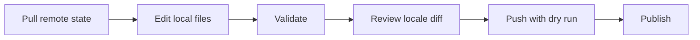

<div align="center">

# storemeta

### App Store Connect and Google Play metadata, managed as code.

Pull, validate, review, and publish localized store listings and screenshots from one version-controlled project.

[](https://www.npmjs.com/package/storemeta)
[](https://www.npmjs.com/package/storemeta)
[](https://github.com/sezaienesyildizhan/storemeta/actions/workflows/ci.yml)
[](LICENSE)

[](https://developer.apple.com/app-store-connect/)
[](https://play.google.com/console/)
[](docs/MARKDOWN_METADATA.md)
[](docs/DOCUMENTATION.md#metadata-layout)
[](package.json)
[](tsconfig.json)

[Quick Start](#quick-start) · [Features](#features) · [Commands](#command-reference) · [Authentication](docs/AUTH_SETUP.md) · [Documentation](docs/DOCUMENTATION.md)

</div>

---

`storemeta` is an open source TypeScript CLI that keeps App Store Connect and Google Play listing content in Git. It replaces repetitive console editing with a local workflow that can be reviewed, validated, diffed, and repeated for every release.

Metadata can be authored in human-friendly **Markdown** or structured **YAML**. Screenshots use predictable platform and locale directories. Remote writes support dry runs so the exact target set can be checked before publishing.

## Why storemeta?

| | Capability | What it gives you |
| --- | --- | --- |
| 📝 | Metadata as code | Review titles, descriptions, keywords, and release notes in pull requests. |
| 🌍 | Locale-aware workflow | Keep Apple and Google locale files organized in one project. |
| 📱 | Screenshot automation | Pull and push screenshots through deterministic platform-specific folders. |
| ✅ | Local validation | Catch malformed config, metadata, locale, credential, and screenshot layouts early. |
| 🔍 | Coverage diffs | See which configured locales are missing or unexpectedly present locally. |
| 🛡️ | Safer publishing | Validate all selected metadata before remote writes and preview pushes with `--dry-run`. |
| 🧰 | Project scaffolding | Generate config, metadata files, and screenshot directories instead of creating them by hand. |

## Features

### Metadata

- Pull localized metadata from App Store Connect and Google Play.
- Push one locale, one platform, or every configured target.
- Use Markdown by default or YAML as an explicit alternative.
- Validate Markdown frontmatter, headings, duplicate sections, locale filenames, and platform mismatches.
- Enforce Google Play title and description length limits locally.
- Reject mixed Markdown and YAML files before starting a remote write.

### Screenshots

- Pull remote screenshots into a canonical local layout.
- Upload Apple screenshot sets and Google Play image groups.
- Preserve deterministic numeric ordering such as `1.png`, `2.png`, `3.png`.
- Validate extensions, directory structure, and numbering before upload.
- Use `--replace` only when remote screenshot sets should be replaced.

### Project tooling

- Check Apple and Google credential configuration with `auth check`.
- Diagnose resolved apps, platforms, and base directories with `config doctor`.
- List configured platform locales with `locales list`.
- Create missing files and folders without overwriting existing metadata with `scaffold`.

## Installation

Install the latest public release from npm:

```bash
npm install --global storemeta
```

Requirements:

- Node.js 20 or newer
- An App Store Connect API key for Apple operations
- A Google Play service account for Google operations

Try the CLI without a global installation:

```bash
npx storemeta --help
```

## Quick Start

### 1. Create a project

Run this inside the repository where store listing content should live:

```bash
storemeta init
```

This creates a starter `storemeta.yml`, Markdown metadata files, and screenshot directories:

```text
storemeta.yml
metadata/
├── apple/
│   └── en-US.md
└── google/
    └── en-US.md
screenshots/
├── apple/
│   └── en-US/
│       └── APP_IPHONE_65/
└── google/
    └── en-US/
        └── phoneScreenshots/
```

### 2. Configure the app

Replace the placeholder identifiers and choose the locales you manage:

```yaml
version: 1

project:
  name: My Mobile App
  defaultApp: mobile-app

apps:
  mobile-app:
    metadata:
      baseDir: metadata
      format: markdown
    screenshots:
      baseDir: screenshots

    apple:
      appId: "1234567890"
      credentials:
        issuerIdEnv: STORE_APPLE_ISSUER_ID
        keyIdEnv: STORE_APPLE_KEY_ID
        privateKeyPathEnv: STORE_APPLE_PRIVATE_KEY_PATH
      locales:
        default: [en-US, tr]

    google:
      packageName: com.example.mobileapp
      credentials:
        serviceAccountPathEnv: STORE_GOOGLE_SERVICE_ACCOUNT_PATH
      locales:
        default: [en-US, tr]
```

### 3. Configure credentials

`storemeta` reads credentials from environment variables. Secret values never belong in `storemeta.yml`.

```bash
export STORE_APPLE_ISSUER_ID="..."
export STORE_APPLE_KEY_ID="..."
export STORE_APPLE_PRIVATE_KEY_PATH="/absolute/path/to/AuthKey_XXXXXXXXXX.p8"
export STORE_GOOGLE_SERVICE_ACCOUNT_PATH="/absolute/path/to/service-account.json"
```

See the complete [authentication setup guide](docs/AUTH_SETUP.md) for creating keys, granting store access, and troubleshooting credential errors.

### 4. Check the local project

```bash
storemeta auth check
storemeta config doctor
storemeta scaffold
storemeta validate
```

### 5. Pull, edit, and publish

```bash
# Pull the current Apple metadata for one locale.
storemeta metadata pull --platform apple --locale en-US

# Inspect local locale coverage against the config.
storemeta metadata diff --platform all

# Validate and preview the upload without remote writes.
storemeta metadata push --platform all --dry-run

# Publish after reviewing the dry-run output.
storemeta metadata push --platform all
```

## Markdown or YAML

Markdown is the default because long descriptions and release notes remain comfortable to read and edit. YAML remains supported for teams that generate metadata programmatically.

### Markdown, the default

Configure it with:

```yaml
metadata:
  baseDir: metadata
  format: markdown
```

Then author one `.md` file per platform and locale:

```md
---
locale: en-US
---

# App Store Listing

## App Name

Focus Atlas

## Subtitle

Plan less. Finish more.

## Description

Build focused work sessions, review your progress, and protect time for what matters.

## Keywords

focus,timer,productivity,planning
```

The full frontmatter, heading, alias, parsing, and validation contract is documented in [Markdown Metadata Format](docs/MARKDOWN_METADATA.md).

### YAML, the structured alternative

Existing YAML projects must set the format explicitly:

```yaml
metadata:
  baseDir: metadata
  format: yaml
```

```yaml
locale: en-US
app_name: Focus Atlas
subtitle: Plan less. Finish more.
description: >-
  Build focused work sessions, review your progress, and protect time for
  what matters.
keywords: focus,timer,productivity,planning
```

> [!IMPORTANT]
> A configured app cannot mix Markdown and YAML metadata. Use `.md` files with `format: markdown`, or `.yml`/`.yaml` files with `format: yaml`.

## Command Reference

| Command | Purpose |
| --- | --- |
| `storemeta init` | Create a starter config, Markdown metadata files, and screenshot folders. |
| `storemeta scaffold` | Create missing locale files and folders without overwriting metadata. |
| `storemeta validate` | Validate config, credentials, metadata, and screenshot layout. |
| `storemeta auth check` | Check whether required credential environment variables are present. |
| `storemeta config doctor` | Show the resolved config, app, platforms, and base directories. |
| `storemeta locales list` | List configured default locales by platform. |
| `storemeta metadata pull` | Download localized listing metadata. |
| `storemeta metadata diff` | Compare parsed local metadata locales with configured locales. |
| `storemeta metadata push` | Validate and upload local listing metadata. |
| `storemeta screenshots pull` | Download screenshots into the canonical local layout. |
| `storemeta screenshots diff` | Compare local screenshot locale coverage with configured locales. |
| `storemeta screenshots push` | Validate and upload local screenshots. |

Global targeting options:

```text
--config <path>        Use a config other than storemeta.yml
--app <id>             Select a configured app
--platform <target>    Select apple, google, or all
--locale <code>        Limit the operation to one locale
--dry-run              Preview a push without remote writes
--replace              Replace matching remote screenshot sets
--verbose              Include available error causes
```

Run `storemeta --help` or append `--help` to a command for the latest CLI options.

## Recommended Release Workflow



1. Pull before editing when the store may contain newer content.
2. Keep metadata and screenshots in a dedicated pull request.
3. Run `storemeta validate` before review.
4. Check metadata and screenshot locale coverage with the diff commands.
5. Run every push with `--dry-run` first.
6. Remove `--dry-run` only after verifying the selected app, platform, and locales.

## Security

- Never commit `.p8` keys, service account JSON, access tokens, or real `.env` files.
- Keep credentials under ignored local paths such as `secrets/` or `.env.local`.
- Use environment variable names in config, not credential values.
- Treat `screenshots push --replace` as destructive and review its targets carefully.
- Report security problems according to the [security policy](SECURITY.md).

## Examples and Documentation

- [Complete user and configuration documentation](docs/DOCUMENTATION.md)
- [Apple and Google authentication setup](docs/AUTH_SETUP.md)
- [Markdown metadata specification](docs/MARKDOWN_METADATA.md)
- [Safe mock project](examples/README.md)
- [Markdown metadata examples](examples/metadata-md)
- [YAML metadata examples](examples/metadata)
- [Release process](docs/RELEASING.md)

Everything under `examples/` is fake and safe to publish. Do not replace example identifiers or listings with production values.

## Contributing

Issues and pull requests are welcome. Before opening a PR:

```bash
npm install
npm run check
npm test
npm run build
```

Behavior changes require tests. See [CONTRIBUTING.md](CONTRIBUTING.md) for repository conventions and [AGENTS.md](AGENTS.md) for the complete engineering workflow.

## Project Status

`storemeta` is an early public release. Its current focus is reliable metadata and screenshot workflows for App Store Connect and Google Play. Review dry runs carefully and report reproducible problems through [GitHub Issues](https://github.com/sezaienesyildizhan/storemeta/issues).

## Author

<table>
  <tr>
    <td width="120" align="center">
      <a href="https://github.com/sezaienesyildizhan">
        
      </a>
    </td>
    <td>
      <strong>Sezai Enes YILDIZHAN</strong><br />
      Creator and maintainer of <strong>storemeta</strong><br /><br />
      <a href="https://github.com/sezaienesyildizhan">
        
      </a>
    </td>
  </tr>
</table>

## License

Released under the [MIT License](LICENSE).
